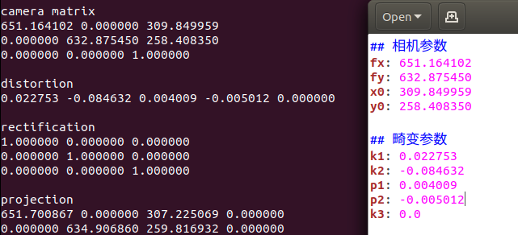

# Prometheus-object-detection
Vision code for P300 quadrotor platform

方向定义： 目标位置 [相机系下：右方x为正，下方y为正，前方z为正]

默认订阅图像话题： /prometheus/camera/rgb/image_raw  (可使用rosrun prometheus_detection web_cam运行相机节点)

默认发布话题：  /prometheus/target (话题格式请参考Prometheus/Modules/msgs/msg/DetectionInfo.msg)

发布话题适用于椭圆、二维码、方框中的手写数字、kcf目标跟踪、yolo等视觉算法

## 安装
```
cd ~
git clone https://github.com/amov-lab/Prometheus.git
./compile_detection.sh
```

## 相机标定
```
# 首先启动相机节点，如需修改相机ID，请参考代码
rosrun prometheus_detection web_cam
rosrun camera_calibration cameracalibrator.py --size 8x6 --square 0.0245 image:=/prometheus/camera/rgb/image_raw
```
size为标点板尺寸，square为每个方格宽度(m)，image:=相机话题

将得到的参数写入如下文件(有关目标尺度的预定义也在这个文件中)
```
Prometheus/Modules/object_detection/config/camera_param.yaml
```


## 运行
```
roscore
rosrun prometheus_detection web_cam  # 启动相机节点，如需修改相机ID，请参考代码
```
1.降落板检测(降落板的具体描述见附录1.1)
```
# 请尽量选择后面两个roslaunch来运行节点
rosrun prometheus_detection landpad_det
# 对于默认的web_cam 
# 默认话题为: /prometheus/camera/rgb/image_raw
roslaunch prometheus_detection landpad_det.launch
# 对于Simulator中gazebo二维码降落板仿真环境
source ${your prometheus path}/Prometheus/devel/setup.bash
export GAZEBO_PLUGIN_PATH=$GAZEBO_PLUGIN_PATH:${your prometheus path}/Prometheus/devel/lib
export GAZEBO_MODEL_PATH=$GAZEBO_MODEL_PATH:${your prometheus path}/Prometheus/Simulator/gazebo_simulator/models
source ${your px4 path}/Firmware_v110/Tools/setup_gazebo.bash ${your px4 path}/Firmware_v110 ${your px4 path}/Firmware_v110/build/px4_sitl_default
export ROS_PACKAGE_PATH=$ROS_PACKAGE_PATH:${your px4 path}/Firmware_v110
export ROS_PACKAGE_PATH=$ROS_PACKAGE_PATH:${your px4 path}/Firmware_v110/Tools/sitl_gazebo
# 运行仿真环境 Prometheus/Simulator/gazebo_simulation/src/iris_gazebo/launch/landing_with_qrcode.launch
roslaunch prometheus_gazebo landing_with_qrcode.launch
# 仿真环境中的图像话题为: /realsense_plugin/camera/color/image_raw
roslaunch prometheus_detection landpad_det_gazebo.launch
```
2.单个二维码检测(二维码示例见附录1.2)
```
rosrun prometheus_detection aruco_det
```
3.椭圆检测(可以通过训练的方式检测中心有特定图案的椭圆，具体方式见附录1.3)
```
rosrun prometheus_detection ellipse_det # 所有的椭圆
rosrun prometheus_detection ellipse_det -wt # 带训练的指定椭圆
```
4.目标跟踪
```
# 请尽量选择后面两个roslaunch来运行节点
rosrun prometheus_detection kcf_tracker
# 对于默认的web_cam 
# 默认话题为: /prometheus/camera/rgb/image_raw
roslaunch prometheus_detection tracker_kcf.launch
# 对于Simulator中gazebo行人跟踪仿真环境
source ${your prometheus path}/Prometheus/devel/setup.bash
export GAZEBO_PLUGIN_PATH=$GAZEBO_PLUGIN_PATH:${your prometheus path}/Prometheus/devel/lib
export GAZEBO_MODEL_PATH=$GAZEBO_MODEL_PATH:${your prometheus path}/Prometheus/Simulator/gazebo_simulator/models
source ${your px4 path}/Firmware_v110/Tools/setup_gazebo.bash ${your px4 path}/Firmware_v110 ${your px4 path}/Firmware_v110/build/px4_sitl_default
export ROS_PACKAGE_PATH=$ROS_PACKAGE_PATH:${your px4 path}/Firmware_v110
export ROS_PACKAGE_PATH=$ROS_PACKAGE_PATH:${your px4 path}/Firmware_v110/Tools/sitl_gazebo
# 运行仿真环境sitl_pedestrain_detection.launch
roslaunch prometheus_gazebo sitl_pedestrain_detection.launch
# 仿真环境中的图像话题为: /realsense_plugin/camera/color/image_raw
roslaunch prometheus_detection tracker_kcf_gazebo.launch
```
3.YOLO检测
```
roslaunch prometheus_detection darknet_ros.launch
```
4.数字检测
```
# 安装python2运行时环境，pytorch和opencv-python
pip install torch==1.4.0+cpu torchvision==0.5.0+cpu -f https://download.pytorch.org/whl/torch_stable.html
pip install opencv-python=='3.4.2.16'
# 如果出现以下报错
# No module named 'skbuild'，执行：
pip install scikit-build
# ft2build.h: No such file or directory，执行：
sudo apt-get install libfreetype6-dev
sudo apt-get install libpng-dev
# 对于gazebo仿真环境
source ${your prometheus path}/Prometheus/devel/setup.bash
export GAZEBO_PLUGIN_PATH=$GAZEBO_PLUGIN_PATH:${your prometheus path}/Prometheus/devel/lib
export GAZEBO_MODEL_PATH=$GAZEBO_MODEL_PATH:${your prometheus path}/Prometheus/Simulator/gazebo_simulator/models
source ${your px4 path}/Firmware_v110/Tools/setup_gazebo.bash ${your px4 path}/Firmware_v110 ${your px4 path}/Firmware_v110/build/px4_sitl_default
export ROS_PACKAGE_PATH=$ROS_PACKAGE_PATH:${your px4 path}/Firmware_v110
export ROS_PACKAGE_PATH=$ROS_PACKAGE_PATH:${your px4 path}/Firmware_v110/Tools/sitl_gazebo
# 启动gazebo中的数字检测仿真环境
roslaunch prometheus_gazebo sitl_number_detection.launch
# 仿真环境中的图像话题为: /realsense_plugin/camera/color/image_raw
# 运行数字检测程序
roslaunch prometheus_detection digitnum_det_gazebo.launch
# 对于实际的相机，默认的web_cam 
# 默认话题为: /prometheus/camera/rgb/image_raw
# 在真实的网络摄像头中 运行数字检测程序
roslaunch prometheus_detection digitnum_det.launch
```

## 附录
### 1.1 降落板具体描述


降落板边长(默认0.6m)，0.6m包括边缘白色部分，黑色部分边长为0.48m

边长参数可在config/camera_param.yaml中修改

### 1.2 二维码示例


所有的二维码都放在了config/aruco_images文件夹中
