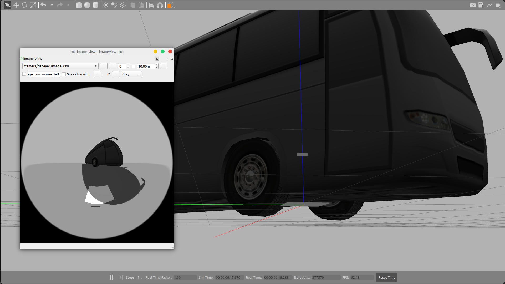
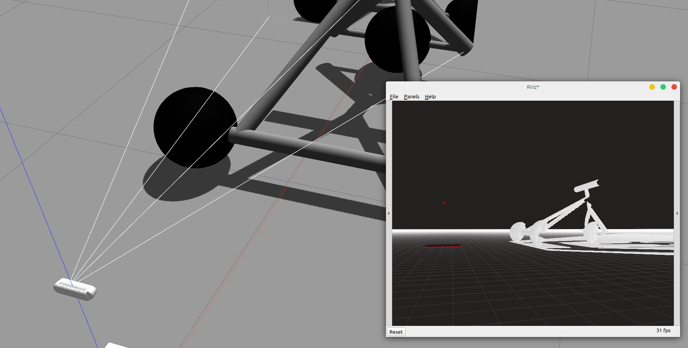

# Intel RealSense Gazebo/ROS
Intel Realsense Tracking and Depth camera simulations and URDF&SDF macros.
T265 & D435i


## RealSense T265 ##



### Usage ###
```xml
<xacro:include filename="$(find realsense_ros_gazebo)/xacro/tracker.xacro"/>

<xacro:realsense_T265 sensor_name="camera" parent_link="base_link" rate="30.0">
  <origin rpy="0 0 0" xyz="0 0 0.5"/>
</xacro:realsense_T265>
```

### Publishers ###
* /camera/**fisheye1**/*
* /camera/**fisheye2**/*
* /camera/**gyro**/sample _( accel and gyro are in the same imu message )_
* /camera/**odom**/sample


## RealSense R200 ##

### Usage ###
```xml
<xacro:include filename="$(find realsense_ros_gazebo)/xacro/depthcam.xacro"/>

<xacro:realsense_R200 sensor_name="camera" parent_link="base_link" rate="30.0">
  <origin rpy="0 0 0" xyz="0 0 0.5"/>
</xacro:realsense_R200>
```

### Publishers ###

* /camera/**color**/*
* /camera/**depth**/*
* /camera/**infra1**/*
* /camera/**infra2**/*


## RealSense D435



### Usage ###
* 启动sdf simulation  
`roslaunch realsense_ros_gazebo simulation_sdf.launch`
* 启动xacro simulation  
`roslaunch realsense_ros_gazebo simulation.launch`

#### xacro
```xml
<xacro:include filename="$(find realsense_ros_gazebo)/xacro/depthcam.xacro"/>

<xacro:realsense_d435 sensor_name="d435" parent_link="base_link" rate="10">
  <origin rpy="0 0 0 " xyz="0 0 0.5"/>
</xacro:realsense_d435>
```

#### sdf
```
    <include>
      <uri>model://realsense_camera</uri>
      <pose>0.12 0 0.02 1.57 0 1.57</pose>
    </include>

    <joint name="realsense_camera_joint" type="fixed">
      <child>realsense_camera::camera_link</child>
      <parent>iris::base_link</parent>
      <axis>
        <xyz>0 0 1</xyz>
        <limit>
          <upper>0</upper>
          <lower>0</lower>
        </limit>
      </axis>
    </joint>

```
其中的iris根据自己的robot model name一致

### Publishers ###

* /camera/**color**/*
* /camera/**depth**/*
* /camera/**infra1**/*
* /camera/**infra2**/*
